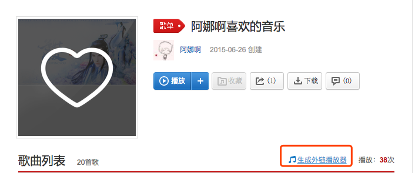

### 需求：在博客中添加一个个人的音乐播放器，在浏览网页时可以放松下心情

首先要在网易云主页获取歌曲的外链，对于自己的歌单可以将之分享出去，然后再获取外链。类似下图




进入后复制iframe代码

```html
<iframe frameborder="no" border="0" marginwidth="0" marginheight="0" width=330 height=450 src="//music.163.com/outchain/player?type=0&id=84390120&auto=1&height=430"></iframe>
```

next的界面文件都位于hexo/themes/next/layout的文件中

如果想将播放器放于sidebar中，则将iframe代码置于_macro文件夹中的sidebar.swig文件中，如果想放置于主页中，则置于_layout.swig文件中即可。
最后保存提交

```
hexo g -d
```